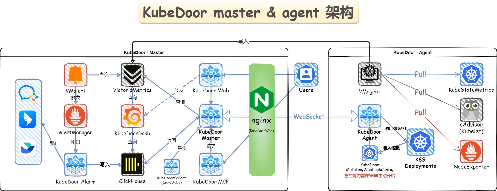

<div align="center">

[](https://starsl.cn)
[](https://github.com/CassInfra/KubeDoor/commits/main)
[](https://github.com/CassInfra/KubeDoor/issues)
[](https://nodejs.org)
[](https://nodejs.org)
[](https://github.com/CassInfra/KubeDoor/blob/main/LICENSE)
[](https://www.murphysec.com/dr/Zoyt5g0huRavAtItj2)


# 花折 - KubeDoor

花开堪折直须折🌻莫待无花空折枝

</div>

---
**国内用户如果访问图片异常，可以访问Gitee同步站：https://gitee.com/starsl/KubeDoor**


## 🏷目录
* [💠全新架构](#全新架构)
* [💎功能描述](#功能描述)
  * [💥 新版功能亮点](#0--新版功能亮点)
  * [📡微服务监控分析管理：多K8S集群统一监控最佳实践](#1-微服务监控分析管理多k8s集群统一监控最佳实践)
  * [🧬异常告警通知与智能聚合](#2-异常告警通知与智能聚合)
  * [💠高峰期P95资源采集分析](#3-高峰期p95资源采集分析)
  * [🚧基于K8S准入控制确保微服务需求值与高峰资源强一致的管控能力](#4-基于K8S准入控制确保微服务需求值与高峰资源强一致的管控能力)
  * [✨其它](#5-其它)
* [🚀部署说明](#kubedoor-全新架构全新部署)
* [🔔KubeDoor交流群](#kubedoor交流群与赞赏)
* [🙇贡献者](#贡献者)
* [🥰鸣谢](#鸣谢)

---

## 🌈概述

🌼**花折 - KubeDoor** 是一个使用Python + Vue开发，基于K8S准入控制机制的微服务资源管控平台，支持多K8S集群统一远程存储、监控、告警、展示。专注微服务每日高峰时段的资源视角，实现了微服务的资源分析统计与强管控，确保微服务资源的资源申请率和真实使用率一致。
## 💠全新架构
<div align="center">

#### 🎉新增K8S事件监控，Pod实时日志，K8S MCP支持！K8S统一管控，多K8S监控、告警、展示的最佳实践🎉

</div>

## 💎功能描述
### 0. 💥 新版功能亮点
##### **💠KubeDoor K8S事件采集分析与监控告警！多K8S事件采集与查询分析，灵活的K8S事件告警规则配置。**
<details close>
<summary>🔍点击展开 ...</summary>

|||
| ------------------------------------| ----------------------------------- |
</details>

##### **💠KubeDoor WEB 新增Pod实时日志跟踪，自动多色标记各级别异常，支持关键字查询定位与过滤。支持日志自带颜色显示。**
<details close>
<summary>🔍点击展开 ...</summary>

||
| ------------------------------------|
</details>

##### **💠KubeDoor 支持多K8S ISTIO VirtualService规则的管理与同步。**
<details close>
<summary>🔍点击展开 ...</summary>

**🚸内部试用阶段，使用MySQL数据源，如需使用，请联系作者协助调试。**
| |  |
| ------------------------------------| ----------------------------------- |
| | |

</details>

##### **💠KubeDoor MCP 体验版来啦！接入任意MCP客户端，即可与LLM对话方式：对您的所有K8S集群操作、资源异常故障分析。**
<details close>
<summary>🔍点击展开 ...</summary>

- 使用任意MCP客户端, 新增MCP服务器, 选择sse类型,地址输入：`http://{nodeIP}:{kubedoor-mcp-NodePort}/sse`即可接入KubeDoor MCP.
- 基于KubeDoor的多K8S管理监控架构与已有的API接口，可以快速生成大量MCP工具来操作K8S与Grafana数据分析，敬请期待！
- **已接入的工具列表与操作演示**

  |  |  |
  | ------------------------------------| ----------------------------------- |
  
  >由于大语言模型的不确定性，请尽量使用带工具确认的MCP客户端（Cline、Cursor）。
  >
  >目前为体验版，暂未做MCP WEB客户端以及工具调用鉴权，请勿将MCP服务端地址暴露到公网。
</details>

---

### 1. 📡微服务监控分析管理：多K8S集群统一监控最佳实践
<div align="center">

</div>

  - 🌊基于VictoriaMetrics全家桶实现**多K8S集群**统一远程存储、监控、告警、展示的一站式K8S监控方案。
  - 🎨集成了K8S节点监控看板与K8S资源监控看板，均支持在单一看板中查看各个K8S集群的资源情况。
  - 📐内置大量K8S资源，JVM资源与K8S节点的告警规则，支持统一告警规则管理，对接各IM告警通知及灵活的@机制。
<div align="center">
   
|  |  | | 
| ------------------------------------| ----------------------------------- | ---------------------------------- |
|  |  || 

</div>

  - 🎭K8S负载实时监控管理页面：及时查看微服务状态，**账号级别授权**的微服务版本更新能力，实时Pod日志查询。
  - ⏱️支持**即时、定时、周期性**执行微服务的**扩缩容和重启**操作。

---

### 2. 🧬异常告警通知与智能聚合

- 🦄K8S微服务统一告警分析与处理页面，告警**按日智能聚合**展示，处理标记，相同告警按日累计计数，每日告警清晰明了。
- 🕹️支持对POD进行**隔离，删除，Java dump，jstack，jfr，JVM**数据采集分析等操作，并通知到IM。
- 📺新增K8S事件采集分析与监控告警！多K8S事件采集与查询分析，灵活的K8S事件告警规则配置。
<div align="center">

|  |  |  |
| ------------------------------------| ----------------------------------- | ----------------------------------- |
|  |  |  |
</div>

---

### 3. 💠高峰期P95资源采集分析

#### 📊采集K8S微服务每日业务高峰时段P95的CPU内存消耗，以及需求、限制值与Pod数。基于采集的数据实现了可视化分析。
  - 🎨**基于日维度采集每日高峰时段P95的资源数据**，可以很好的观察各微服务长期的资源变化情况，即使查看1年的数据也很流畅。
  - 🏅高峰时段全局资源统计与各**资源TOP10**，命名空间级别高峰时段P95资源使用量与**资源消耗占整体资源的比例**
  - 🧿**微服务级别**高峰期整体资源与使用率分析，微服务与**Pod级别**的资源曲线图(需求值,限制值,使用值)
<div align="center">
  
||||
|-|-|-|
||||
</div>

#### 🎡每日从采集的数据中，获取最近10天各微服务的资源信息，获取资源消耗最大日的P95资源，作为微服务的需求值写入数据库。
  - ♻**开启准入控制后**：实现微服务的**需求值自动管理**机制，支持微服务**限制值与Pod数**手动调整的统一强管控页面。
  - ✨**基于准入控制机制**实现K8S微服务资源的**真实使用率和资源申请需求值保持一致**，具有非常重要的意义：
    - 🌊**K8S调度器**通过真实的资源需求值就能够更精确地将Pod调度到合适的节点上，**避免资源碎片，实现节点的资源均衡**。
    - ♻**K8S自动扩缩容**也依赖资源需求值来判断，**真实的需求值可以更精准的触发扩缩容操作**。
    - 🛡**K8S的保障服务质量**（QoS机制）与需求值结合，真实需求值的Pod会被优先保留，**保证关键服务的正常运行**。

---

### 4. 🚧基于K8S准入控制确保微服务需求值与高峰资源强一致的管控能力

- #### <a target="_blank" href="docs/K8S资源管控功能说明.md">👑基于准入控制的管控能力详解</a>

---

### 5. ✨其它
  - ❤️Agent管理页面：更新，维护Agent状态，配置采集与管控。
  - 🔒基于**NGINX basic认证**，支持LDAP，支持接口级权限控制，支持所有**操作审计**日志与通知。
  - 📊所有看板基于Grafana创建，并整合到前端UI内，使得数据分析可以快速实现更优雅的展示。
<div align="center">
   
| | 
| ------------------------------------|
</div>

---

## 📀KubeDoor 全新架构，全新部署
#### 🛠快速安装<a target="_blank" href="docs/灵活部署方案.md">【查看灵活部署方案】</a>
<details close>
<summary>🔍点击展开 ...</summary>

```
### 【下载helm包】
wget https://StarsL.cn/kubedoor/kubedoor-1.5.2.tgz
tar -zxvf kubedoor-1.5.2.tgz
cd kubedoor
### 【master端安装】
# 编辑values-master.yaml文件，请仔细阅读注释，根据描述修改配置内容。
# try
helm upgrade -i kubedoor . --namespace kubedoor --create-namespace --values values-master.yaml --dry-run --debug
# install
helm upgrade -i kubedoor . --namespace kubedoor --create-namespace --values values-master.yaml
### 【agent端安装】
# 编辑values-agent.yaml文件，请仔细阅读注释，根据描述修改配置内容。
helm upgrade -i kubedoor-agent . --namespace kubedoor --create-namespace --values values-agent.yaml --set tsdb.external_labels_value=xxxxxxxx
```
</details>

#### ♻更新指引[【版本变更记录】](https://github.com/CassInfra/KubeDoor/releases/tag/1.5.2)

<details close>
<summary>🔍点击展开 ...</summary>

```
# 下载安装包
wget https://StarsL.cn/kubedoor/kubedoor-1.5.2.tgz
tar -zxvf kubedoor-1.5.2.tgz
```
```
# 旧版本更新到1.3.0及以上版本需要新增2个数据库字段
ALTER TABLE kubedoor.k8s_agent_status ADD COLUMN nms_not_confirm Bool DEFAULT false AFTER admission_namespace;
ALTER TABLE kubedoor.k8s_agent_status ADD COLUMN scheduler Bool DEFAULT false AFTER nms_not_confirm;
```
**注意：**
- 请参考已经已经部署好的configmap: `kubedoor-info`中的`VictoriaMetrics`, `ClickHouse`等配置项修改`values-master.yaml`, `values-agent.yaml`的对应配置，确保使用的配置与旧版本一致。(因yaml配置有调整，不可直接替换文件。)
- 或者使用以下命令查看部署时候的values配置信息，并修改到`values-master.yaml`, `values-agent.yaml`的对应配置。
```
helm get values kubedoor -n kubedoor
helm get values kubedoor-agent -n kubedoor
```
#【master端更新】
helm upgrade -i kubedoor . --namespace kubedoor --create-namespace --values values-master.yaml
#【agent端更新】
helm upgrade -i kubedoor-agent . --namespace kubedoor --create-namespace --values values-agent.yaml --set tsdb.external_labels_value=xxxxxxxx

</details>

#### 🌐使用说明
<details close>
<summary>🔍点击展开 ...</summary>

- **访问WebUI 并初始化数据：**
  1. 使用K8S节点IP + kubedoor-web的NodePort访问，默认账号密码都是 **`kubedoor`**
  2. 点击`agent管理`，先开启`自动采集`，设置好`高峰期时段`，再执行采集：输入需要采集的`历史数据时长`，点击`采集`，即可采集历史数据并更新高峰时段数据到管控表。
- **注意：**
  - 开启自动采集后，每天凌晨1点会采集前一天的高峰期数据，并将10天内最大资源消耗日的数据写入到更新管控表。
  - 重复执行`采集`不会导致重复写入数据，请放心使用；每次采集后都会自动将10天内最大资源消耗日的数据写入到管控表。如果耗时较长，请等待采集完成或缩短采集时长。
  - 如果您是新安装的监控系统，并且已过了当天的高峰期时段，将会无法采集到数据；需要等第二天高峰期时段之后才能采集到数据。
</details>

---

## 🔔KubeDoor交流群与🧧赞赏

<div align="center">

#### 如果觉得项目不错，麻烦动动小手点个⭐️Star⭐️ 如果你还有其他想法或者需求，欢迎在 issue 中交流


无法加群可关注公众号入群

</div>

## 🙇贡献者
<div align="center">
<table>
<tr>
    <td align="center">
        <a href="https://github.com/starsliao">
            
            <br />
            <sub><b>StarsL.cn</b></sub>
        </a>
    </td>
    <td align="center">
        <a href="https://github.com/xiaofennie">
            
            <br />
            <sub><b>xiaofennie</b></sub>
        </a>
    </td>
    <td align="center">
        <a href="https://github.com/shidousanxia">
            
            <br />
            <sub><b>shidousanxia</b></sub>
        </a>
    </td>
    <td align="center">
        <a href="https://github.com/comqx">
            
            <br />
            <sub><b>comqx</b></sub>
        </a>
    </td>
  </tr>
</table>
</div>

## 🥰鸣谢

感谢如下优秀的项目，没有这些项目，不可能会有**KubeDoor**：
- [TRAE](www.trae.ai) [Python](https://www.python.org/) [AIOHTTP](https://github.com/aio-libs/aiohttp) [VUE](https://cn.vuejs.org/) [Pure Admin](https://pure-admin.cn/) [Element Plus](https://element-plus.org) [Kubernetes](https://kubernetes.io/) [VictoriaMetrics](https://victoriametrics.com/) [ClickHouse](https://clickhouse.com/) [Grafana](https://grafana.com/) [Nginx](https://nginx.org/) ...

**特别鸣谢**
- [**CassTime**](https://www.casstime.com)：**KubeDoor**的诞生离不开🦄**开思**的支持。
